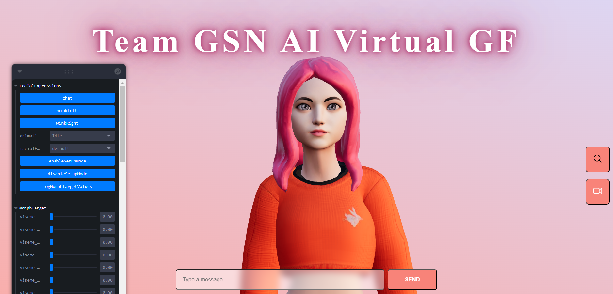

# TechFest Team GSN

## AI COMPANION
This project is an AI Companion application developed by TEAM GSN, utilizing Three.js and React for the frontend, and leveraging ElevenLabs for AI voice generation and OpenAI for intelligent responses.

<div>


</div>



### Team Member:

- [Lim Jing Jie](https://github.com/bron322)
- [Ng Yuen Herng](https://github.com/ngyh6726)
- [Tan Wei Yin](https://github.com/wytan12)
- [Prakritipong Phuvajakrt](https://github.com/Phuvj)

---

### Environment Set up for Local Deployment (Recommended)

This project is developed with [React 18](https://react.dev/) and tested on [Visual Studio Code](https://code.visualstudio.com/).

**To run the application:**  
First, clone the repository into your local device, the directory should look something like this:

Initialise your `.env` file. Check `.env.example` in Backend for the environment variables required.

You will require:

- [OpenAI](https://openai.com/) API Key
- [ElevenLabs](https://elevenlabs.io/) API Key

Next, set up the backend, in the terminal:

```
cd Backend
npm i
node index.js
```

Next, set up the frontend, in a new terminal:

```
cd .\app\
npm i
npm run dev
```

---

### Section 1: Introduction

The AI Girlfriend project serves as a beacon of companionship in an era where loneliness has become increasingly prevalent. With the rise of digital communication and social distancing measures, many individuals find themselves longing for meaningful connections. By harnessing advanced technologies, this project endeavors to provide solace and support to those navigating the complexities of modern life.

---

### Section 2: Features

#### 2.1 Realistic Interaction

Users can engage in conversations with the AI companion, receiving responses generated by OpenAI for a more human-like interaction.

#### 2.2 Voice Generation

The AI companion's responses are synthesized into speech using ElevenLabs, providing users with spoken feedback for a more immersive experience.

#### 2.3 3D Visualization

The AI companion is represented by a 3D character rendered using Three.js, allowing for visual interaction and enhancing the overall user experience.

---

_Submission: This repository is submitted to Nanyang Technological University Singapore as a project for TechFest Hackathon
